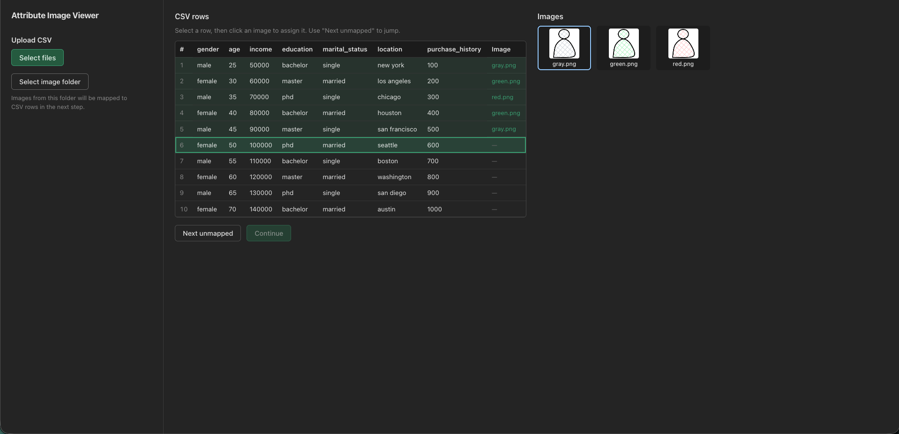
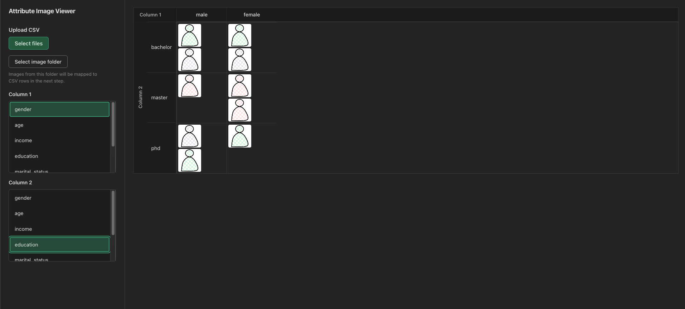

# Attribute Image Viewer

A small data visualization tool for comparing images across different combinations of attributes. When you have images that map to data records (e.g., experiment results, samples, or participants), this app lets you arrange and view those images in a matrix by two chosen attributes—so you can quickly compare how images differ across attribute values.

## What it does

1. **Load your data** — Upload a CSV where each row is a record and one column contains the image filename (or path) for that row.
2. **Point to your images** — Select the folder that contains the image files. The app uses the File System Access API (supported in Chromium-based browsers).
3. **Map rows to images** — Confirm or adjust which image file corresponds to each CSV row.
4. **Choose two attributes** — Select two columns from your CSV as the axes for the view.
5. **View the matrix** — Images are shown in a grid: one attribute along rows, the other along columns. You can compare images across different attribute combinations at a glance.

## Getting started

```bash
npm install
npm run dev
```

Open the URL shown in the terminal (typically `http://localhost:5173`). For the folder picker to work, use a Chromium-based browser (e.g. Chrome, Edge).

## Sample data

The `sample_data/` directory includes a small CSV and references to image files so you can try the workflow without your own dataset.

## Screenshots




---

Built with React, TypeScript, and Vite.
